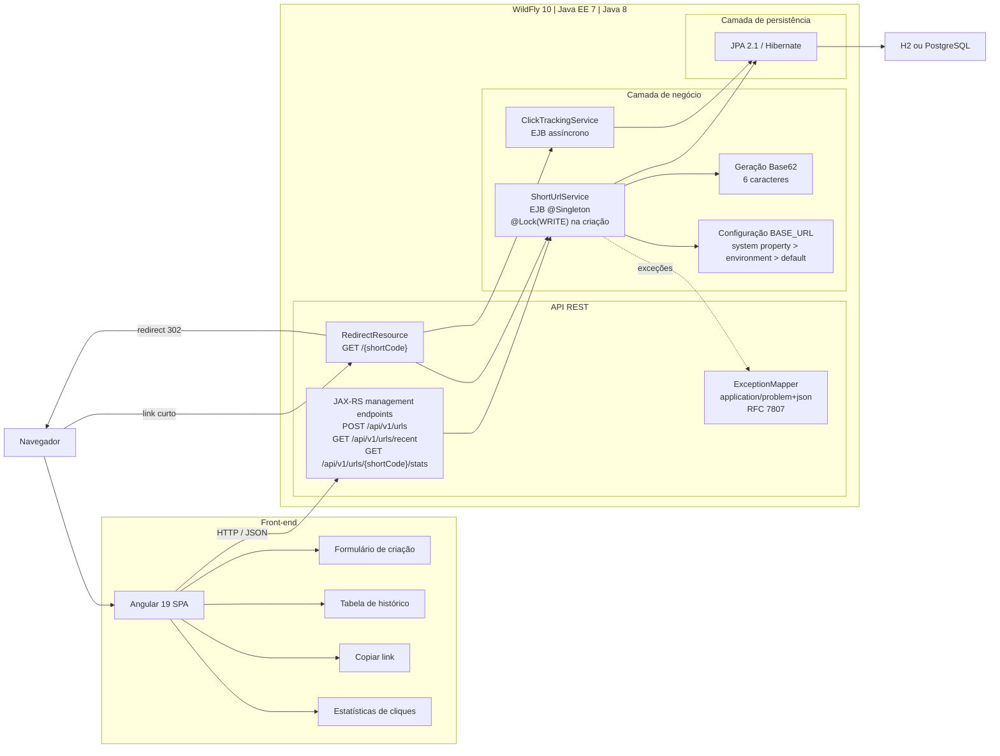

# Encurtador de URL

## Visão Geral

O projeto contém uma API Java 8 empacotada como WAR para WildFly 10 e uma SPA Angular 19 independente. O backend usa Java EE 7: JAX-RS/RESTEasy para HTTP, CDI para injeção, EJB para concorrência e execução assíncrona, JPA 2.1/Hibernate para persistência e Bean Validation para validar entradas.

O backend respeita as camadas `domain`, `dto`, `repository`, `service`, `resource` e `exception`. A SPA fica em `frontend/` e consome a API pelo caminho relativo `/api/v1/urls`.

O datasource padrão é `java:jboss/datasources/ExampleDS`, fornecido pelo WildFly. O context root do WAR é `/sht`, definido em `src/main/webapp/WEB-INF/jboss-web.xml`. Os códigos gerados automaticamente usam seis caracteres Base62; a resposta inclui `shortUrl`, com base configurável e padrão local `http://localhost:8080/sht/`.

## Visão Geral da Arquitetura

O diagrama resume o fluxo entre a SPA, os endpoints REST e as camadas de negócio e persistência.



## Como Executar

### API e WildFly

Requisitos: JDK 8 ou superior e Maven 3.6 ou superior. Para compilar, executar os testes e gerar o WAR:

```sh
mvn clean package
```

O artefato fica em `target/shortener.war`. Para executar em Docker com links locais:

```sh
docker build -t shortener-wildfly10 .
docker run --rm -p 8080:8080 -e SHORTENER_BASE_URL=http://localhost:8080/sht shortener-wildfly10
```

Em produção, defina `SHORTENER_BASE_URL` com o domínio público, por exemplo `https://gld.at`. Também é possível configurar a base com a propriedade de sistema `-Dshortener.base-url=https://gld.at`; essa propriedade tem precedência sobre a variável de ambiente.

### SPA Angular

Requisitos: Node.js 22 LTS e npm. A versão principal do Node está registrada em `frontend/.nvmrc` e declarada em `frontend/package.json`. O proxy Angular encaminha `/api` para `http://localhost:8080/sht`, evitando CORS durante o desenvolvimento local.

```sh
cd frontend
npm install
npm start
```

A SPA fica disponível em `http://localhost:4200`. Para gerar os arquivos estáticos de produção:

```sh
npm run build
```

O conteúdo é gerado em `frontend/dist/shortener-ui/browser`. Publique-o em um servidor estático ou CDN e configure o proxy de produção para encaminhar `/api` ao context path do WAR. O frontend e a API devem compartilhar a mesma origem pública para manter o endpoint relativo e evitar CORS.

### Endpoints

```text
POST /api/v1/urls
GET  /{shortCode}
GET  /api/v1/urls/recent
GET  /api/v1/urls/{shortCode}/stats
```

Exemplo de criação:

```json
{
  "originalUrl": "https://example.com/article",
  "customAlias": "article",
  "expiresAt": "2027-01-01T00:00:00"
}
```

`customAlias` é opcional e aceita de 3 a 32 caracteres alfanuméricos, `_` ou `-`. Códigos automáticos têm seis caracteres. `expiresAt` é opcional e usa ISO-8601 `LocalDateTime`. Erros de negócio e validação retornam `application/problem+json` no formato Problem Details.

Para PostgreSQL, configure um datasource JTA no WildFly, atualize `jta-data-source` e o dialeto em `src/main/resources/META-INF/persistence.xml`.

## Justificativas de Design

`ShortUrlService` é um EJB `@Singleton` com gerenciamento de concorrência pelo contêiner. Consultas usam `@Lock(READ)` e a criação usa `@Lock(WRITE)`, serializando a validação do alias, a geração Base62 e a persistência dentro de cada instância WildFly. `SecureRandom` escolhe os caracteres entre os 62 símbolos; a restrição única no banco permanece como garantia de integridade.

O JAX-RS é publicado na raiz para permitir o redirecionamento `/{shortCode}` e os recursos de gerenciamento em `/api/v1/urls`. Os recursos traduzem HTTP para chamadas de serviço, mantendo regras de negócio e persistência fora da camada REST.

A SPA usa componentes standalone, `HttpClient` e formulários Angular sem camada adicional de estado ou roteamento. O proxy de desenvolvimento encaminha as chamadas para o context path do WAR; em produção, um reverse proxy serve a SPA e encaminha `/api` para o WildFly na mesma origem.

O clique é registrado por um EJB `@Asynchronous`, em uma transação `REQUIRES_NEW`. A transação grava o timestamp e incrementa o contador por uma operação aritmética no banco, sem leitura-modificação-gravação concorrente. O redirecionamento 302 não espera essa tarefa; por isso, métricas são eventualmente consistentes.

## Trade-offs

O lock do EJB serializa apenas chamadas dentro de uma instância WildFly. Com múltiplas instâncias, a restrição única do banco impede persistência duplicada, mas não coordena toda a seção crítica entre nós. Um lock distribuído, uma sequência transacional no banco ou uma geração de códigos baseada em identificadores seriam opções para escala horizontal.

O log mantém um registro por clique e a consulta de métricas retorna o histórico completo. Para maior volume, cabem cache Redis para leituras, mensageria JMS para processamento de cliques, paginação, retenção configurável e consolidação de métricas.

O frontend é publicado separadamente do WAR. Essa separação mantém o empacotamento Java independente do toolchain Node e permite servir os arquivos Angular por CDN ou servidor estático; exige, em contrapartida, configurar o reverse proxy de produção.

## Testes

Os testes do backend usam JUnit 4 e Mockito. Cobrem criação com alias, códigos Base62 de seis caracteres, alias duplicado, URL inválida e link expirado.

```sh
mvn test
```

Para compilar a SPA:

```sh
cd frontend
npm install
npm run build
```

Testes de integração podem implantar o WAR no WildFly para cobrir JPA, serialização, códigos HTTP e execução assíncrona, além de testar os fluxos da SPA contra o servidor integrado.

O workflow do GitHub Actions executa `mvn clean verify` com Java 8, `npm ci` e `npm run build` com Node 22, publica o WAR como artefato e roda o smoke test integrado em WildFly 10. Para executar o smoke test localmente, inicie o WildFly e o Angular (`npm start`) e rode:

```sh
bash scripts/integration-smoke-test.sh
```

O workflow é disparado em `push`, `pull_request` e manualmente por `workflow_dispatch`. Para consultar as cinco execuções mais recentes pelo GitHub CLI:

```sh
gh run list --repo thishugo/api-topaz --limit 5
```

Para inspecionar o resultado e os jobs `build` e `integration` de uma execução, use o ID exibido na listagem:

```sh
gh run view <run-id> --repo thishugo/api-topaz
```

O acesso a este repositório privado exige autenticação prévia com `gh auth login`. Também é possível consultar os runs na aba **Actions** do repositório. O WAR fica disponível como artefato `shortener-war` por sete dias.

O workflow valida a aplicação em ambiente temporário; o deploy em um ambiente externo não é automatizado.
